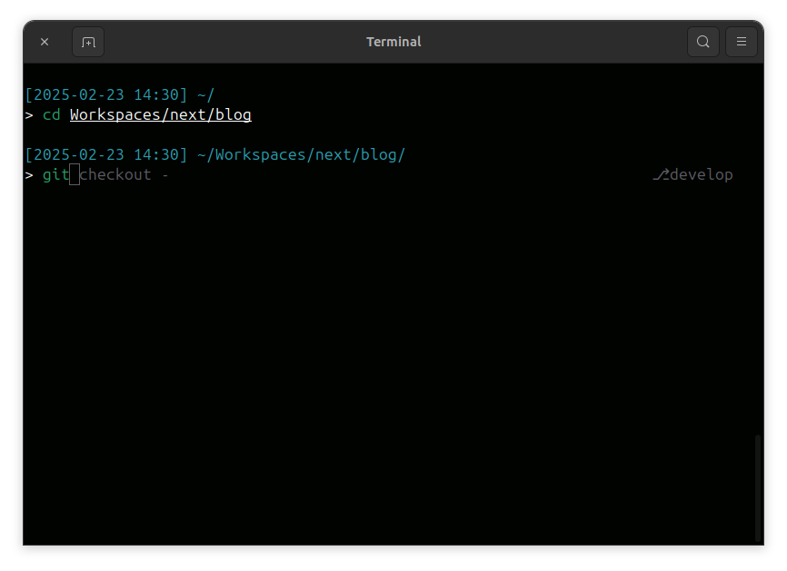

# Simple Zsh Configuration

A lightweight and efficient Zsh configuration without Oh My Zsh dependencies. This configuration provides advanced autocompletion, syntax highlighting, and useful defaults while maintaining speed and simplicity.



## Features

- Advanced autocompletion with menu selection
- Case-insensitive completion
- Syntax highlighting
- Command suggestions
- History management
- Directory stack navigation

## Prerequisites

- Zsh shell
- Git

## Installation

Downlaod and run the installation script:

```bash
curl https://raw.githubusercontent.com/mtt-merz/simple-zsh/refs/heads/main/install.sh | zsh
```

OR

1. Clone the repository:

```bash
git clone https://github.com/mtt-merz/simple-zsh.git
cd simple-zsh
```

2. Run the installation script:

```bash
zsh ./install.sh
```

## License

MIT License - See [LICENSE](./LICENSE) file for details
